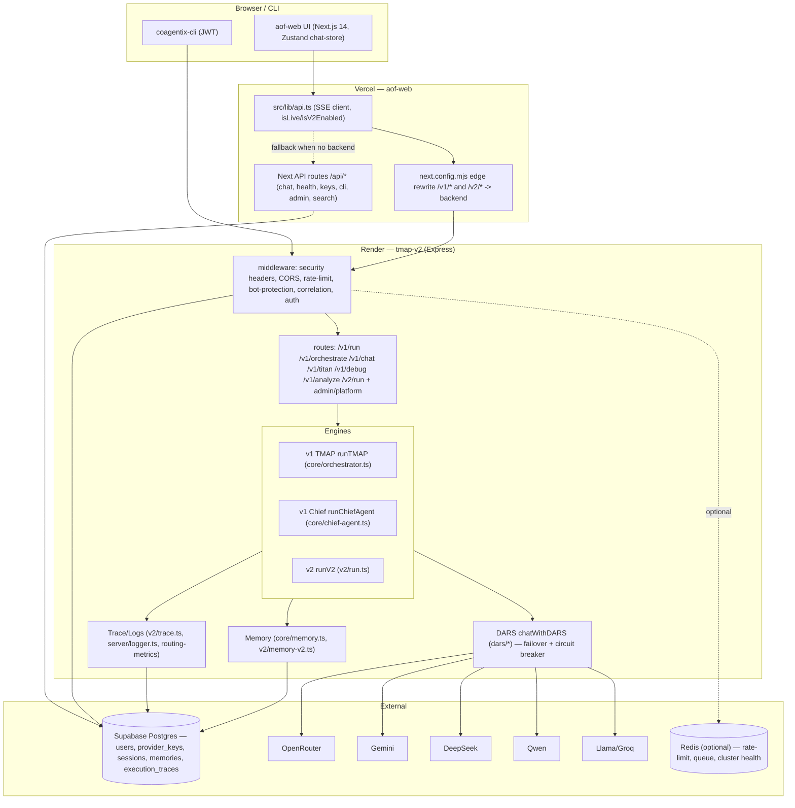
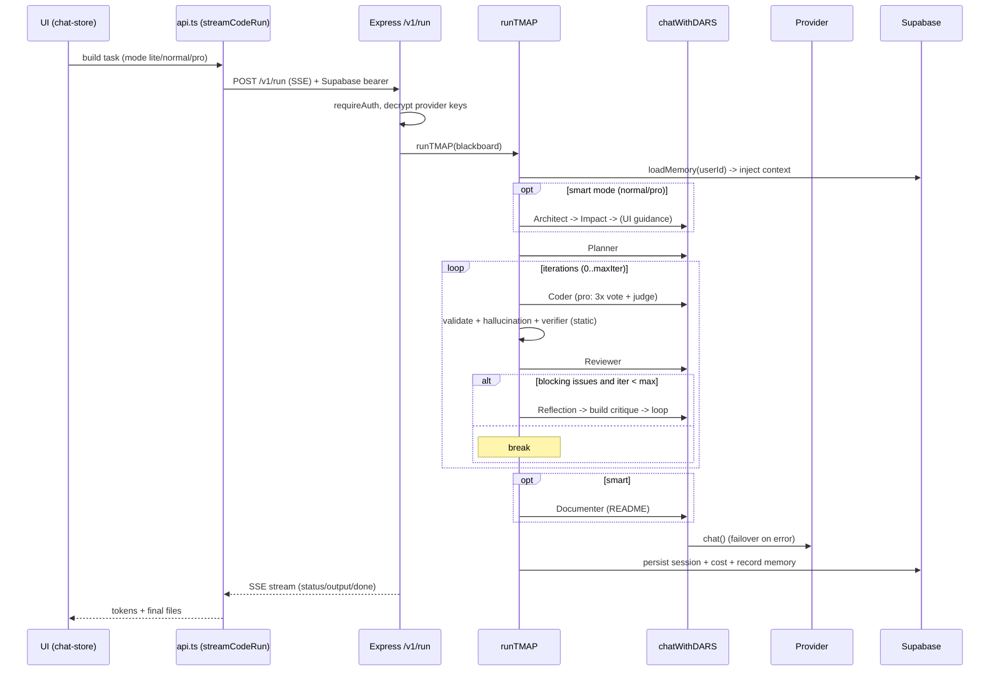
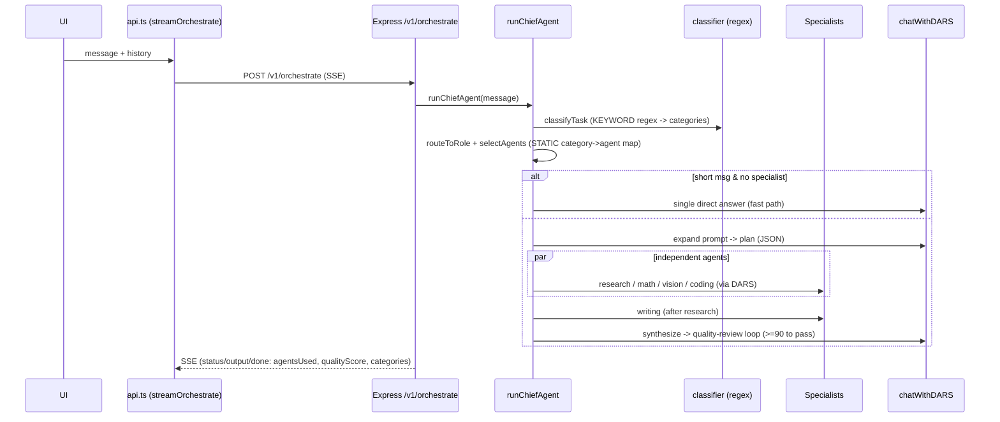
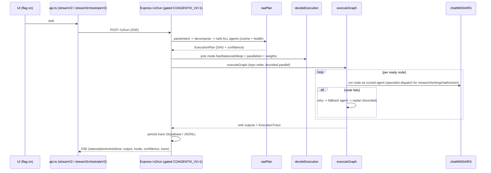
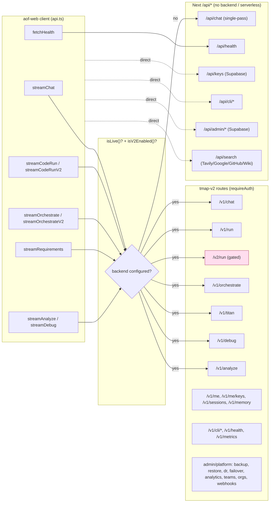
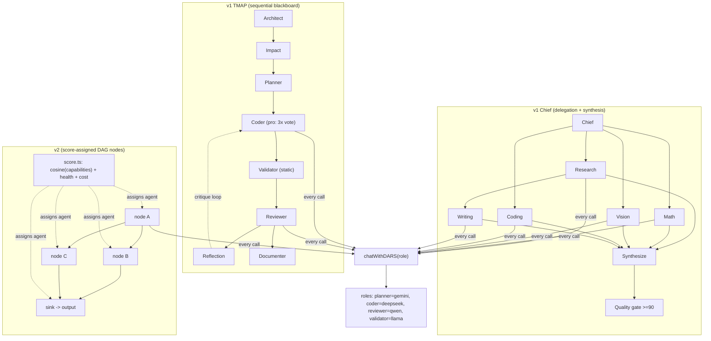
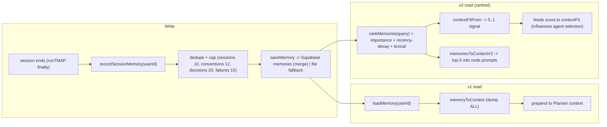
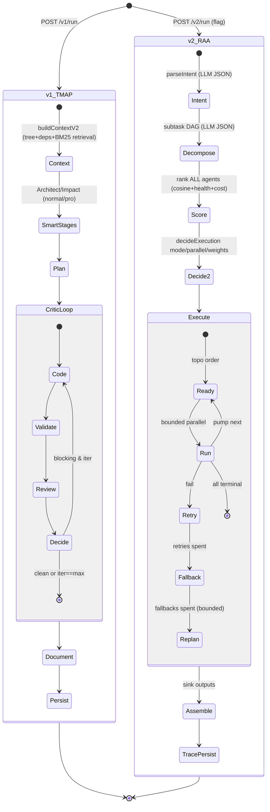

# Coagentix (Co.Ai) — Architecture Report

> **Scope:** system understanding only. No code was modified to produce this document.
> **Basis:** direct reading of source (`tmap-v2/src/**`, `aof-web/src/**`), not README/marketing.
> **As-of:** 2026-06-22, branch `claude/v1-to-v2-migration-phase0-2` (PR #26). Reflects the live v1 engine **and** the now-wired-but-default-off v2 engine.

---

## 0. TL;DR

Coagentix is a two-tier product: a **Next.js frontend** (`aof-web`, on Vercel) and an **Express multi-agent backend** (`tmap-v2`, on Render), sharing a **Supabase** Postgres for auth, per-user encrypted provider keys, sessions, and memory. All model calls are **BYOK** (bring-your-own-key) and routed through **DARS**, a resilience layer with a circuit breaker and capability-scored failover across 5 OpenAI-compatible providers (OpenRouter, Gemini, DeepSeek, Qwen, Llama).

There are **three backend execution engines** behind separate routes:

| Engine | Route | Selector | Status |
|---|---|---|---|
| **v1 TMAP** (code build) | `POST /v1/run` | `runTMAP` — linear Plan→Code→Validate→Review→Critique | **LIVE (default)** |
| **v1 Chief** (universal chat) | `POST /v1/orchestrate` | `runChiefAgent` — keyword classify → static agent map | **LIVE (default)** |
| **v2** (score-based RAA + DAG) | `POST /v2/run` | `runV2` — cosine scoring + DAG executor | **WIRED, default-off** (flags `COAGENTIX_V2` + `NEXT_PUBLIC_COAGENTIX_V2`) |

---

## 1. Current Architecture

### 1.1 Component diagram

### 1.2 Key facts (from source)
- **Auth bridge** (`server/auth.ts`): accepts a native tmap-v2 **JWT** (username/PIN + CLI) OR a **Supabase access token** (Google sign-in). Supabase users get a synthesized record whose provider keys load from the shared `provider_keys` table.
- **Secrets at rest** (`server/crypto.ts`): provider keys encrypted with **AES-256-GCM**, key derived via **scrypt** from `COAGENTIX_MASTER_KEY`. Versioned blobs (`coagentix2:` / legacy `aof2:` / pre-KDF) keep old ciphertexts decryptable.
- **Providers** (`config.ts`): 5 vendors, all called via one OpenAI-compatible client (`providers/client.ts`). Fail-closed when no key (no fabricated output in prod; mock only when `mockAllowed()`).
- **Frontend degradation** (`api.ts`): when no backend is configured (`isLive()===false`), chat/build fall back to a single-pass `/api/chat` (no multi-agent pipeline).

---

## 2. Runtime Execution

### 2.1 Build request (live default: `/v1/run` → `runTMAP`)

### 2.2 Chat request (live default: `/v1/orchestrate` → `runChiefAgent`)

### 2.3 v2 request (opt-in: `/v2/run` → `runV2`)

---

## 3. API Flow

**Auth on every `/v1/*` and `/v2/*` call:** `requireAuth` tries native JWT, then `verifySupabaseToken`. Admin/platform routes additionally require `requireAdmin` (allowlist `COAGENTIX_ADMIN_USERNAMES`, secure-by-default empty).

---

## 4. Agent Communication

**Communication medium:**
- v1 build = a shared **Blackboard** object (`createBlackboard`) mutated stage-to-stage; no message bus.
- v1 chief = function calls; agent outputs collected into an array then synthesized.
- v2 = **DAG node outputs** merged into dependents' inputs (`gatherInputs`); lifecycle **EventBus** (`v2/events.ts`) emits node_start/complete/fail/replan (currently consumed mainly by the trace mirror).
- **Selection differs fundamentally:** v1 chief picks agents by **keyword category** (`classifier.ts` + `selectAgents`); v2 picks by **cosine capability score + live health** (`score.ts`), no keyword branching.

---

## 5. Memory Lifecycle

**Critical distinction:**
- v1 memory **influences generation** (dumped into the prompt) but **not decisions**, and is **unranked**.
- v2 memory is **ranked** and feeds a `contextFit` signal that **influences agent scoring** — but only on the (default-off) v2 path.
- Storage: Supabase `memories` table when configured, else per-key JSON file; **best-effort** (never breaks a run). On Vercel/serverless, file storage is ephemeral (`/tmp`).

---

## 6. Orchestration Lifecycle

**Resource controls:** v1 iteration caps are fixed per mode (`lite=0, normal=1, pro=3`). v2 derives mode (fast/balanced/deep) + parallel slots + replan budget from a probabilistic score (`decideExecution`). Cost is **tracked** (`estimateCost`, provider usage or char/4 estimate) but only v2 lets cost feed back into selection weights.

---

## 7. Dependency Graph

```mermaid
graph TD
  IDX["server/index.ts (entry, all routes)"]
  IDX --> AUTH["server/auth.ts"] --> CRYPTO["server/crypto.ts"]
  AUTH --> SBA["server/supabase-auth.ts"]
  AUTH --> DB["server/db.ts (Supabase)"]
  IDX --> ORCH["core/orchestrator.ts (runTMAP)"]
  IDX --> CHIEF["core/chief-agent.ts (runChiefAgent)"]
  IDX --> V2RUN["v2/run.ts (runV2)"]
  IDX --> TITAN["core/titan.ts"]
  IDX --> RAA1["core/raa.ts"]
  IDX --> DBG["core/debugger.ts"] & ANA["core/analyze.ts"]
  IDX --> IMG["core/image-pipeline.ts + image-memory.ts"]
  IDX --> EVAL["core/eval-framework.ts"] & SBX["core/sandbox.ts + docker-sandbox.ts"] & USG["core/usage-tracker.ts"]

  ORCH --> AGENTS["core/agents.ts (planner/coder/reviewer)"]
  ORCH --> VOTE["core/vote.ts"] & SELF["core/self-critique.ts"] & REFL["core/reflection.ts"]
  ORCH --> HALL["core/hallucination-detector.ts"] & VER["core/verifier-agent.ts"] & VAL["core/validator.ts"]
  ORCH --> CTX["core/context-engine.ts"] --> RETR["core/retrieval.ts (BM25)"]
  ORCH --> ARCH["core/architect.ts"] & IMP["core/impact.ts"] & DOC["core/documenter.ts"]
  ORCH --> MEM["core/memory.ts"]

  CHIEF --> CLASS["core/classifier.ts (regex)"]
  CHIEF --> MR["core/model-router.ts"] & PE["core/prompt-engineer.ts"] & RG["core/review-gate.ts"]
  CHIEF --> RSCH["core/research-agent.ts"] & WRIT["core/writing-agent.ts"] & MATH["core/math-agent.ts"] & VIS["core/vision-agent.ts"]

  V2RUN --> REG["v2/registry.ts"] --> SCORE["v2/score.ts"]
  V2RUN --> RAA2["v2/raa.ts"] --> DAG["v2/dag.ts"]
  V2RUN --> EXEC["v2/executor.ts"] & ORC2["v2/orchestrator-v2.ts"] & MEM2["v2/memory-v2.ts"] & TRC["v2/trace.ts"] & EVT["v2/events.ts"]
  V2RUN --> RSCH & WRIT & MATH & VIS
  V2RUN --> MEM

  ORCH & CHIEF & V2RUN --> DARS["dars/run.ts"] --> SEL["dars/select.ts"] & HLTH["dars/health.ts"] & CLS["dars/classify.ts"]
  DARS --> CLIENT["providers/client.ts"] --> PROV["5 providers (OpenAI-compatible)"]
  ALLCFG["config.ts (loads .env, providers, mockAllowed)"]
  ORCH & CHIEF & V2RUN & DARS --> ALLCFG
```

### Notable graph facts
- **`config.ts` loads `.env` on import** (`import 'dotenv/config'`) — a transitive dependency of nearly everything; this makes local tests non-hermetic (they make real LLM calls).
- **Shared reuse v1↔v2:** v2 now reuses the four specialist agents and `core/memory.ts`; both engines funnel through DARS → `providers/client.ts`.
- **Recently removed:** `advanced-router.ts`, `critic-agent.ts` (orphaned). `retrieval.ts` is **kept** (live via `context-engine.ts`).

---

## 8. Bottlenecks

| # | Bottleneck | Evidence | Impact |
|---|---|---|---|
| B1 | **Call amplification** | Chief full path = 5–7 calls; pro build vote = 4; Titan = 8+ self-review passes | Latency + free-tier rate-limit exhaustion (the #1 failure cause) |
| B2 | **Sequential pipelines** | v1 TMAP stages run in order; no file-level parallelism | Slow builds; v2 DAG parallelism only on the default-off path |
| B3 | **No LLM response caching** | `providers/client.ts` posts every call fresh | Repeated/near-duplicate prompts re-billed |
| B4 | **Large context injection** | `CONTEXT_SUMMARY_CEILING = 64KB`; memory dumped wholesale (v1) | Token cost; useful-context dilution |
| B5 | **In-memory health/rate-limit** | `HealthStore` Map + in-proc rate-limit | Per-instance only; lost on cold start; inconsistent across Render replicas |
| B6 | **Per-request key decryption** | scrypt-derived key cached, but keys decrypted per request (`/v1/run`, `/v1/me`) | CPU on hot paths; mitigated by cache |

---

## 9. Risks

| # | Risk | Evidence | Severity |
|---|---|---|---|
| R1 | **Master-key cross-service coupling** | `COAGENTIX_MASTER_KEY` must be byte-identical on Vercel + Render or keys silently fail to decrypt (`auth.ts keepDecryptableKeys`) | High (silent degradation to "no key") |
| R2 | **Ephemeral storage without Supabase** | `memory.ts`/`db.ts` fall back to disk; Vercel/Render disks are ephemeral | High (data loss on redeploy; preflight warns) |
| R3 | **Non-hermetic tests** | `config.ts` loads `.env`; v1 tests hit real providers and flake on rate limits | Medium (CI safe — no `.env`; local misleading) |
| R4 | **Mock fabrication** | `mockAllowed()` true outside production; mock can emit plausible fake code/answers | Medium (fail-closed in prod by default) |
| R5 | **Prompt-injection surface** | User task flows directly into agent system/user prompts; no mitigation | Medium (inherent to product, undocumented) |
| R6 | **v2 is single-task** | `/v2/run` takes only `task` (no history); chat folds recent turns into the task | Medium (weaker conversational continuity than v1 chief) |
| R7 | **Two-engine fork** | v1 + v2 maintained in parallel until Phase 3 | Medium (double bug-fix surface) |
| R8 | **Stubbed billing / account-deletion** | frontend "coming soon" toasts | Low/compliance (no payment; manual deletion) |

---

## 10. Critical Dependencies

| Dependency | Used for | Failure mode | Resilience |
|---|---|---|---|
| **Supabase Postgres** | auth bridge, provider_keys, sessions, memory, execution_traces | auth fails / memory degrades | memory/trace fall back to file; auth has no fallback (hard dep for Google users) |
| **`COAGENTIX_MASTER_KEY`** | decrypt provider keys | all keys undecryptable | degrades to "no key" (fail-closed), not crash |
| **`JWT_SECRET`** | native sessions/CLI | login/CLI broken | preflight aborts boot in prod if missing |
| **AI providers (≥1 key)** | every model call | no key → fail-closed error | DARS failover across all candidate providers + OpenRouter routes |
| **DARS layer** | all engines' model access | single point all calls traverse | internal circuit breaker + EWMA health + retries |
| **`config.ts` / dotenv** | provider/role config | misconfig | defaults + `mockAllowed` gate |
| **Redis (optional)** | distributed rate-limit, queue, cluster health | features no-op without it | optional deps; in-memory fallbacks |
| **Vercel↔Render link** | `COAGENTIX_API_PROXY` rewrite makes `/v1`,`/v2` same-origin | frontend can't reach backend → `/api/chat` fallback | graceful degrade to single-pass chat |

---

## 11. Summary Assessment

- **Strengths:** clean separation (frontend/backend/data); strong resilience (DARS circuit breaker + scored failover); solid secrets-at-rest; genuinely distinct multi-agent prompts; a high-quality v2 engine (DAG, scoring, retry/fallback/replan, reconstructable trace) now wired in.
- **Central architectural tension:** the most advanced engine (v2) is still **default-off**, while the live path routes by **keyword** (chat) and runs a **linear** pipeline (build). The migration (PR #26, Phases 0–2) closes the wiring gap; **Phase 3 (retire v1) is deferred pending a production canary**.
- **Before scale:** move `HealthStore` + rate-limit to Redis (R/B5), guarantee Supabase durability (R2), and harden the master-key operational contract (R1).

*End of report. No source code was modified.*
