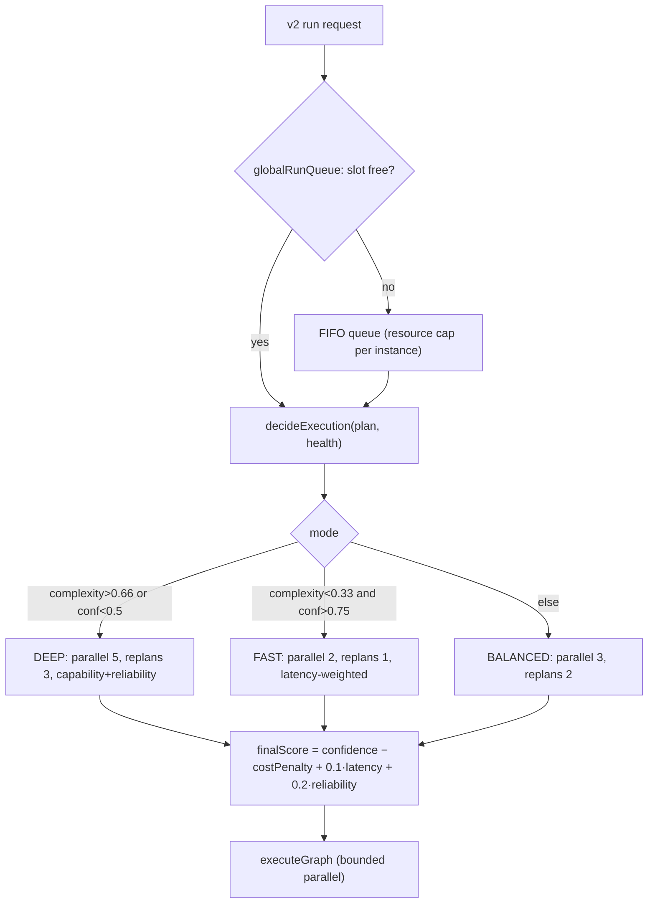

# Orchestrator Report — System Controller

> **Goal:** turn the orchestrator into a system controller: resource allocation, execution modes, cost optimization, latency optimization, load balancing, queue management.
> **Honesty note:** `v2/orchestrator-v2.ts` **already** decided execution modes + intra-run resource allocation + cost from live health. This phase added the two missing controller responsibilities — **latency optimization (FAST mode)** and **cross-run queue management** — and documents where load balancing lives.

---

## 1. Requirement coverage

| Capability | Status | Where |
|---|---|---|
| **Execution modes FAST / BALANCED / DEEP** | ✅ pre-existing | `decideExecution` → mode from complexity + confidence |
| **Resource allocation (within a run)** | ✅ pre-existing | mode → `{maxParallel, maxReplans}` profile |
| **Cost optimization** | ✅ pre-existing | `costPenalty` in `finalScore`; `budgetTight` raises cost weight |
| **Latency optimization** | 🆕 **added** | `latency` scoring factor (RAA v2) + **FAST mode raises `weights.latency` to 0.25** |
| **Queue management (across runs)** | 🆕 **added** | `v2/queue.ts:RunQueue` (FIFO semaphore); `runV2` wraps execution in `globalRunQueue` |
| **Load balancing** | ✅ via DARS | provider-level health-scored selection in `dars/select.ts` (`scoreCandidate`: capability + reliability + speed + cost); circuit breaker sheds load from degraded providers |

---

## 2. Controller decision flow

## 3. What was added (this phase)

### Latency optimization (`orchestrator-v2.ts`)
- FAST mode now reweights selection toward speed: `latency 0.25`, `capability 0.30`, `cost 0.15`. Combined with the new `latency` scoring factor, simple/high-confidence work routes to the **quickest healthy** agent.
- DEEP mode (capability+reliability heavy) and `budgetTight` (cost heavy) behavior unchanged.

### Queue management (`v2/queue.ts` + `run.ts`)
- `RunQueue`: a fair (FIFO) counting semaphore. `acquire()` returns a release fn; on release the slot is **handed directly to the next waiter** (no thundering herd). Release is idempotent. Capacity via `COAGENTIX_V2_MAX_CONCURRENT` (default 4).
- `globalRunQueue`: one process-wide queue. `runV2` now runs inside `globalRunQueue.run(...)`, so a burst of requests **queues** instead of stampeding every provider at once (a primary cause of rate-limit failures).
- Exposes `inFlight` / `queued` / `capacity` for observability.

### Load balancing (already present — documented)
- DARS distributes load across providers by **health score** (`dars/select.ts:scoreCandidate` blends capability, reliability, speed, cost) and sheds traffic from degraded providers via the circuit breaker (`dars/health.ts`). The orchestrator's job is *resource control*; provider load balancing is DARS's.

---

## 4. Verification
- `npm run typecheck` clean.
- New tests: `fast mode raises the latency weight`, `RunQueue bounds concurrency and queues the overflow` (peak concurrency capped at 2 across 5 jobs), `RunQueue release is idempotent`.
- v2 orchestrator + engine suites: **26/26 pass** (hermetic).

## 5. Files changed
- `tmap-v2/src/v2/queue.ts` — **new** (`RunQueue`, `globalRunQueue`, `defaultMaxConcurrent`).
- `tmap-v2/src/v2/run.ts` — wrap `runV2` in `globalRunQueue`; split body into `runV2Inner`.
- `tmap-v2/src/v2/orchestrator-v2.ts` — FAST-mode latency weighting.
- `tmap-v2/src/tests/v2-orchestrator.test.ts` — latency-weight + RunQueue tests.

## 6. Execution modes (reference)
| Mode | Trigger | maxParallel | maxReplans | Weight bias |
|---|---|---|---|---|
| **FAST** | complexity < 0.33 & confidence > 0.75 | 2 | 1 | latency |
| **BALANCED** | otherwise | 3 | 2 | defaults |
| **DEEP** | complexity > 0.66 or confidence < 0.5 | 5 | 3 | capability + reliability |

## 7. Notes
- Queue is per-instance (in-memory), consistent with the current `HealthStore`. A cross-instance queue would use Redis/BullMQ (`server/queue.ts` already present) — future work, same as the health-store-to-Redis item.
- All changes remain on the **default-off** v2 path; live behavior is unchanged until the canary flags are set.
