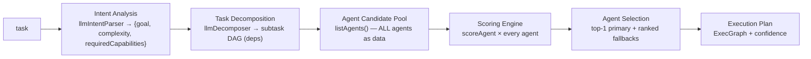

# RAA v2 Report

> **Goal:** make RAA a real decision engine (Intent → Decompose → Candidate Pool → Scoring → Selection → Plan) with six scoring factors.
> **Honesty note:** most of this pipeline **already existed** in `v2/raa.ts` + `v2/score.ts` + `v2/registry.ts` (it was the unreachable engine surfaced in the audit). This phase **closed the two real gaps**: an explicit **latency** factor and the separation of **historical success** from **reliability**. No rebuild-from-scratch — that would have regressed working, tested code.

---

## 1. The decision pipeline (now complete)



Files: `v2/raa.ts` (pipeline), `v2/score.ts` (scoring), `v2/registry.ts` (pool), `v2/dag.ts` (plan shape), `v2/memory-v2.ts` (context-fit input), `v2/run.ts` (wiring).

**No keyword routing, no static category→agent map** anywhere in this path — selection is purely `rankAgents()` output. (Contrast: the live v1 `chief-agent.ts`/`classifier.ts` path, which this engine replaces.)

---

## 2. Scoring engine — six explicit factors

`v2/score.ts:scoreAgent` now computes all six factors the spec requires, each as **live data** (no branching on task text):

| Factor | Source | Formula |
|---|---|---|
| **capability** | `registry` capability vector vs. required | cosine similarity |
| **context fit** | `memory-v2` ranked memory → `contextFit` | `clamp01(contextFit)` |
| **reliability** | DARS `HealthStore` *current* health | `circuit==open ? 0 : successRate` |
| **historical success** | agent telemetry / success EWMA | `historicalScore ?? successRate` |
| **latency** ⟵ **NEW** | DARS `ewmaLatencyMs` | `1 / (1 + ewmaLatencyMs/1000)` |
| **cost** | agent `costTier` | `1 - costTier` |

### Default weights (sum 1.0, capability-dominant)
```
capability 0.35 · context 0.10 · cost 0.10 · historicalSuccess 0.15 · reliability 0.15 · latency 0.15
```

### What changed (this phase)
- **Added `latency`** as a first-class scoring factor (previously latency only influenced the orchestrator's `finalScore`, never agent selection).
- **Split `performance` → `historicalSuccess` + kept `reliability` separate.** Rationale: a brand-new circuit trip (reliability→0) must drop an agent *immediately*, independent of a strong long-run track record (`historicalSuccess`). Conflating them let a historically-good but currently-broken provider keep winning.
- Updated `DEFAULT_WEIGHTS`, `scoreAgent`, and the `ScoreWeights` type. `orchestrator-v2.ts` weight tweaks (budgetTight/deep) remain valid (keys preserved).

---

## 3. Memory & confidence (verified real)
- **Memory influence:** `rankMemories` → `contextFitFrom` → the `context` factor in scoring. Memory affects *selection*, not just generation.
- **Confidence:** `ExecutionPlan.confidence` = mean of selected nodes' top scores; consumed by `decideExecution` to choose execution mode. Low confidence → `deep` mode.

---

## 4. Verification
- `npm run typecheck` clean.
- New test `scoring exposes six factors incl. a latency factor that favors faster providers` — asserts all six `parts` exist and a high-latency provider scores low on the latency factor and below a fresh one.
- v2 engine + orchestrator suites: **22/22 pass** (hermetic).
- Existing assertions (coder wins `{code:1}`, specialist selection, circuit-open reliability=0, budgetTight cost weight) all still hold — capability remains dominant, so rankings are unchanged for the tested cases; latency only breaks near-ties.

---

## 5. Files changed
- `tmap-v2/src/v2/score.ts` — six-factor `ScoreWeights`, new latency + historicalSuccess factors, reweighted defaults.
- `tmap-v2/src/tests/v2-engine.test.ts` — latency-factor regression test.

## 6. Remaining (out of this phase)
- Single-task `/v2/run` (no conversation history) — chat folds recent turns into the task; native history is a future enhancement.
- Registry is in-process seed data (extensible via `registerAgent`); DB/telemetry-driven loading is future work.
- Engine remains **default-off** pending the production canary (Phase 3 of the migration plan).
