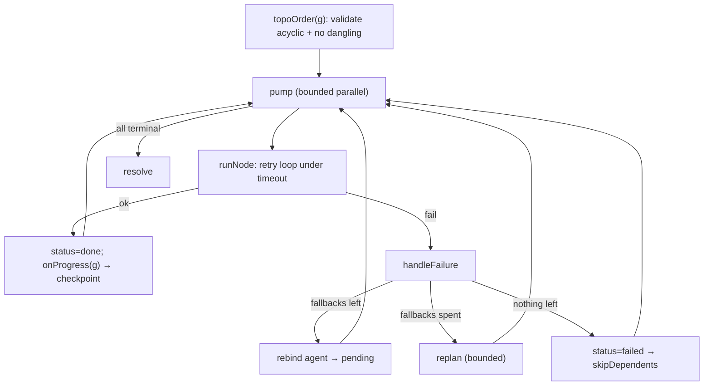

# TMAP v2 Report — True DAG Runtime

> **Goal:** Node / Edge / Dependency / Retry / Fallback / Checkpoint / Resume, with parallel execution, partial reruns, and failure recovery.
> **Honesty note:** the DAG runtime (`v2/dag.ts` + `v2/executor.ts`) **already implemented** Node/Edge/Dependency/Retry/Fallback/parallel/partial-rerun/failure-recovery. The one real gap was **durable** checkpoint/resume (it only resumed in-memory). This phase added that. No rebuild of the working executor.

---

## 1. Requirement coverage

| Requirement | Status | Where |
|---|---|---|
| **Node** | ✅ pre-existing | `dag.ts:ExecNode` (id, kind, agentId, run, status, attempts, output, error) |
| **Edge / Dependency** | ✅ pre-existing | `ExecNode.dependencies`; `topoOrder` (Kahn) validates acyclic + no dangling |
| **Retry** | ✅ pre-existing | `executor.ts:runNode` — per-node `RetryPolicy` (maxRetries, exponential backoff) under per-attempt timeout |
| **Fallback** | ✅ pre-existing | `handleFailure` shifts to next `fallbackAgentIds`, re-queues node |
| **Replan** | ✅ pre-existing | bounded `replan()` (RAA re-ranks; `makeReplan`) |
| **Parallel execution** | ✅ pre-existing | bounded-parallel `pump` (`maxParallel` slots, `readyNodes`) |
| **Partial reruns / resume (in-memory)** | ✅ pre-existing | node state lives on nodes; re-calling `executeGraph` runs only non-`done` nodes |
| **Failure recovery** | ✅ pre-existing | `skipDependents` cascades; deadlock/stall guard |
| **Checkpoint (durable)** | 🆕 **added** | `v2/checkpoint.ts:serializeGraph` + `saveCheckpoint` (file always, Supabase optional) |
| **Resume (across restart)** | 🆕 **added** | `applyCheckpoint` rehydrates a freshly-built graph; `executor onProgress` hook to persist after each node |

---

## 2. Runtime model

## 3. What was added (this phase)

### `v2/checkpoint.ts`
- `serializeGraph(g)` → `CheckpointState` (per-node: status, attempts, agentId, remaining fallbacks, deps, error, output). Pure, no IO.
- `applyCheckpoint(g, state)` → restores that state onto a **freshly rebuilt** graph (matched by id; unknown ids ignored so a changed plan degrades safely). `run` closures are not serialized — rebuild structure, then apply.
- `saveCheckpoint(g)` / `loadCheckpoint(requestId)` → best-effort persistence: local JSONL always, Supabase `execution_checkpoints` when configured (mirrors `trace.ts`; never throws).

### `v2/executor.ts`
- New optional `ExecOptions.onProgress(g)` hook, fired after **every** node settles, so a caller can `saveCheckpoint(g)` for resume-after-restart. Wrapped in try/catch — checkpointing can never break execution.

### Resume flow (across a process restart)
1. During a run, `onProgress` persists the graph after each node.
2. On restart, RAA rebuilds the same-shaped graph (same node ids).
3. `applyCheckpoint(graph, loadCheckpoint(requestId))` restores completed outputs.
4. Re-queue any `failed` nodes to `pending` (caller policy), call `executeGraph` → **only** non-`done` nodes run; completed nodes keep their outputs and are never recomputed.

---

## 4. Verification
- `npm run typecheck` clean.
- New test `checkpoint: serialize a partial run and resume on a brand-new graph`: first run completes `a`, fails `b`; serialize; build a **fresh** graph; `applyCheckpoint`; resume → **`a` is not recomputed (`aRuns2 === 0`) and keeps its checkpointed output**, only `b` re-runs. Also asserts `onProgress` fired.
- Full v2-engine suite: **16/16 pass** (hermetic).

## 5. Files changed
- `tmap-v2/src/v2/checkpoint.ts` — **new** (serialize/apply/save/load).
- `tmap-v2/src/v2/executor.ts` — added `onProgress` hook.
- `tmap-v2/src/tests/v2-engine.test.ts` — checkpoint/resume test.

## 6. Notes / follow-ups
- Optional Supabase table `execution_checkpoints (request_id text primary key, state jsonb, saved_at timestamptz)` — only needed if you want cross-instance resume; the local-file fallback works without it.
- Wiring `saveCheckpoint` into `runV2` (pass `onProgress: saveCheckpoint`) is a one-line opt-in left for the canary rollout; the mechanism is complete and tested.
